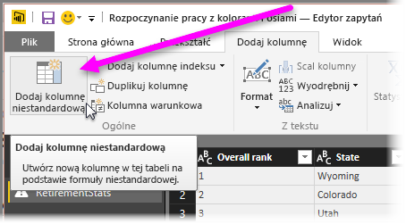

# Histogramy
Jest kilka sposobów tworzenia histogramów w usłudze Power BI. Zaczniemy od najprostszego sposobu, a następnie omówimy kolejne metody.

## Proste histogramy
Na początku ustal, w którym zapytaniu znajduje się pole, na podstawie którego chcesz utworzyć histogram.  Utwórz nowe zapytanie za pomocą opcji *Odwołanie* i nazwij je *NazwaPola — histogram*. Wybierz opcję **Grupuj według** na wstążce **Przekształć** i wybierz agregację **Zlicz wiersze**. Upewnij się, że typem danych jest liczba w wynikowej kolumnie agregującej. Następnie możesz utworzyć wizualizację tych danych na stronie raportów. To szybka i łatwa metoda, ale nie sprawdza się w przypadku wielu punktów danych ani nie zapewnia wzajemnego sprzężenia między wizualizacjami.

## Definiowanie przedziałów umożliwiających utworzenie histogramu
Ustal, w którym zapytaniu znajduje się pole, na podstawie którego chcesz utworzyć histogram. Utwórz nowe zapytanie za pomocą opcji *Odwołanie* i nazwij je *NazwaPola*.  Zdefiniuj przedziały korzystające z reguły. Użyj opcji **Dodaj kolumnę niestandardową**  na wstążce **Dodaj kolumnę** i utwórz regułę niestandardową.

Upewnij się, że typem danych jest liczba w wynikowej kolumnie agregującej. Aby uzyskać histogram, możesz użyć techniki grupowania opisanej w poprzedniej sekcji **Proste histogramy**. Ta opcja pozwala korzystać z większej liczby punktów danych, ale wciąż nie zapewnia sprzężenia.

## Definiowanie histogramu, który obsługuje sprzężenie
Sprzężenie polega na połączeniu wizualizacji — gdy użytkownik wybierze punkt danych w bieżącej wizualizacji, następuje wyróżnienie lub odfiltrowanie punktów danych, które są powiązane z wybranym punktem, w pozostałych wizualizacjach na stronie raportu.  Ponieważ manipulowanie danymi odbywa się w czasie wykonywania zapytania, musimy utworzyć relację między tabelami oraz wiedzieć, który element odpowiada przedziałowi na histogramie i na odwrót.

Rozpocznij od wybrania opcji *Odwołanie* względem zapytania, które zawiera pole, na podstawie którego chcesz utworzyć histogram.  Nowe zapytanie nazwij *Przedziały*.  W tym przykładzie oryginalne zapytanie nazwiemy *Szczegóły*.  Następnie usuń wszystkie kolumny z wyjątkiem tej, która ma być przedziałem dla histogramu.  Wybierz funkcję *Usuń duplikaty* w zapytaniu — dostępnej w menu wywoływanym prawym przyciskiem myszy po wybraniu kolumny — aby pozostałe wartości w kolumnie były unikatowe. Jeśli masz liczby dziesiętne, możesz najpierw skorzystać z porady dotyczącej definiowania przedziałów w celu utworzenia histogramu. Pozwoli to uzyskać zestaw przedziałów, którym można łatwo zarządzać.  Sprawdź dane wyświetlane w podglądzie zapytania. Jeśli widać wartości puste lub wartości null, musisz się ich pozbyć przed utworzeniem relacji. Zobacz „Tworzenie relacji w przypadku danych z wartościami pustymi lub wartościami null”. Metoda ta może sprawiać problemy ze względu na konieczność sortowania. Aby zapewnić poprawne sortowanie zasobników, zobacz „Kolejność sortowania: zapewnianie odpowiedniej kolejności wyświetlania kategorii”. 

> [!NOTE]
> Warto zastanowić się nad kolejnością sortowania przed utworzeniem wizualizacji.   
> 
> 

Następny krok polega na zdefiniowaniu relacji między zapytaniami *Przedziały* i *Szczegóły* w kolumnie przedziałów.  W programie *Power BI Desktop* wybierz pozycję *Zarządzaj relacjami* na wstążce.  Utwórz relację między zapytaniem *Przedziały* znajdującym się w lewej tabeli a zapytaniem *Szczegóły* znajdującym się w prawej tabeli, a następnie wybierz pole, na podstawie którego chcesz utworzyć histogram. 

Ostatnim krokiem jest utworzenie histogramu. Przeciągnij pole Przedział z tabeli *Przedziały*. Usuń domyślne pole z wynikowego wykresu kolumnowego.  Przeciągnij pole histogramu z tabeli *Szczegóły* do tej samej wizualizacji. W obszarze pól zmień domyślną agregację na Zlicz. W wyniku tych czynności otrzymamy histogram. Jeśli utworzysz inną wizualizację, taką jak mapa drzewa, na podstawie tabeli Szczegóły, wybierz punkt danych na mapie drzewa, aby wyróżnić histogram i wyświetlić histogram dla wybranego punktu danych względem trendu w całym zestawie danych.

