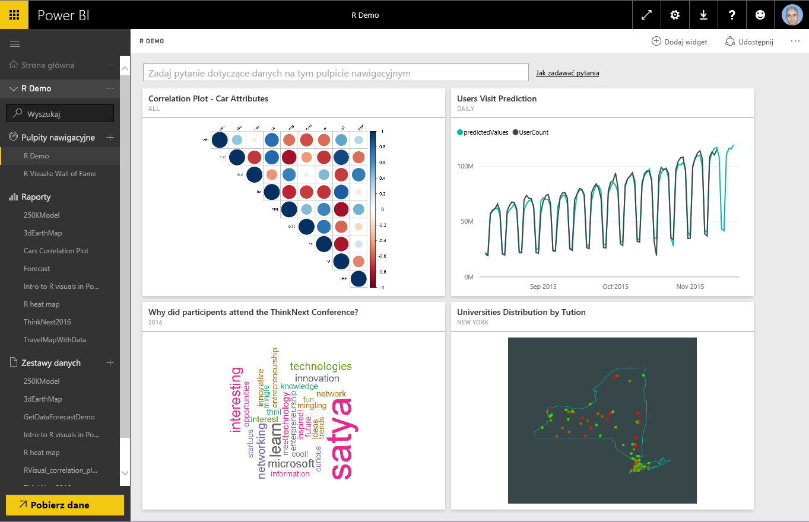
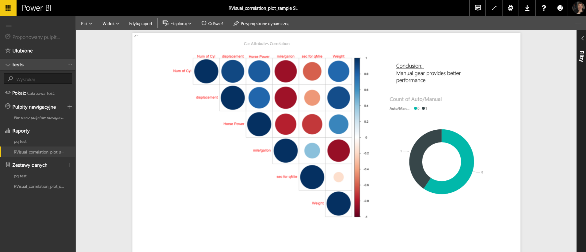
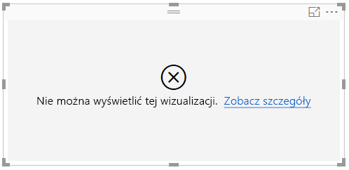
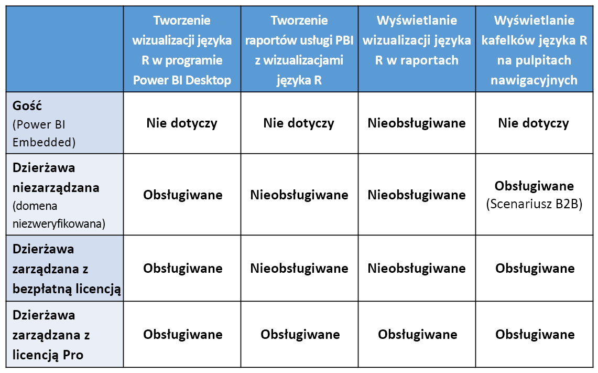

# Tworzenie wizualizacji języka R w usłudze Power BI
Usługa Power BI obsługuje wyświetlanie i używanie wizualizacji utworzonych za pomocą skryptów języka R. Korzystając z wizualizacji utworzonych za pomocą skryptów języka R, powszechnie nazywanych *wizualizacjami języka R*, można przedstawiać zaawansowane kształtowanie danych i zaawansowaną analizę danych (na przykład prognozy), używając rozbudowanych możliwości analizy i wizualizacji języka R.

> [!NOTE]
> [Język programowania R](https://www.r-project.org/) jest jednym z języków najczęściej używanych przez statystyków, analityków danych i analityków biznesowych. Wokół języka R zgromadziła się społeczność autorów rozwiązań typu „open source”, która oferuje ponad 7000 dodatkowych pakietów, oraz szerokie grono grup użytkowników. Wersja języka R wdrożona w usłudze Power BI to *Revolution R Open 3.2.2.*
> 
> 

Poniższa ilustracja przedstawia pulpit nawigacyjny usługi Power BI z kolekcją wizualizacji języka R używanych na potrzeby zaawansowanej analizy.

Wizualizacje języka R są tworzone w [raportach programu Power BI Desktop](../desktop-get-the-desktop.md), takich jak raport pokazany na poniższej ilustracji.

Po utworzeniu raportu zawierającego jeden lub kilka wizualizacji języka R w programie **Power BI Desktop** można go opublikować w usłudze Power BI. Obecnie wizualizacje języka R można tworzyć tylko w programie **Power BI Desktop**, a następnie publikować je w usłudze Power BI. Aby uzyskać więcej informacji na temat tworzenia wizualizacji języka R, zobacz [Tworzenie wizualizacji usługi Power BI przy użyciu języka R (Power BI Desktop)](../desktop-r-visuals.md).

Należy pamiętać, że nie wszystkie pakiety języka R są obsługiwane w usłudze Power BI. Na końcu tego artykułu znajduje się lista pakietów obsługiwanych obecnie w tej usłudze.

Możesz pobrać ten [przykładowy plik programu Power BI Desktop](http://download.microsoft.com/download/D/9/A/D9A65269-D1FC-49F8-8EC3-1217E3A4390F/RVisual_correlation_plot_sample%20SL.pbix) (plik pbix), który zawiera kilka wizualizacji języka R, aby zobaczyć, jak to działa, oraz aby poeksperymentować.

Wizualizacje języka R utworzone w programie **Power BI Desktop**, a następnie opublikowane w usłudze Power BI, w większej mierze zachowują się jak każda inna wizualizacja w usłudze Power BI — można wchodzić z nimi w interakcje, filtrować je, wycinać i przypinać do pulpitu nawigacyjnego oraz udostępniać innym osobom. Aby uzyskać więcej informacji na temat udostępniania pulpitów nawigacyjnych i wizualizacji, zobacz [Udostępnianie pulpitu nawigacyjnego współpracownikom i innym osobom](../service-share-dashboards.md). Jedna różnica w porównaniu z innymi wizualizacjami polega na tym, że w wizualizacjach języka R nie można wyświetlać etykietek narzędzi i nie można ich używać do filtrowania innych wizualizacji.

Jak widać na poniższej ilustracji, wizualizacje języka R w usłudze Power BI, zarówno w pulpitach nawigacyjnych, jak i raportach, w dużej mierze są wyświetlane i zachowują się jak wszystkie inne wizualizacje, i użytkownicy nie muszą wiedzieć, że zostały one utworzone na podstawie języka R.

## Bezpieczeństwo skryptów języka R
Wizualizacje języka R są tworzone na podstawie skryptów języka R, które potencjalnie mogą zawierać kod zagrażający prywatności i bezpieczeństwu.

Te zagrożenia istnieją głównie w fazie tworzenia, kiedy autor skryptu uruchamia go na swoim komputerze.

W usłudze Power BI jest stosowana technologia *piaskownicy* w celu ochrony użytkowników i usługi przed zagrożeniami bezpieczeństwa.

Zastosowanie *piaskownicy* nakłada pewne ograniczenia na skrypty języka R uruchamiane w usłudze Power BI. Dotyczą one na przykład uzyskiwania dostępu do Internetu lub do innych zasobów, które nie są wymagane do utworzenia wizualizacji języka R.

## Błędy skryptów języka R
Gdy skrypt języka R napotka błąd, wizualizacja języka R nie jest kreślona i jest wyświetlany komunikat o błędzie. Aby uzyskać szczegółowe informacje na temat błędu, wybierz pozycję **Zobacz szczegóły** w obszarze błędu wizualizacji języka R na kanwie, jak pokazano na poniższej ilustracji.

Na kolejnej ilustracji pokazano inny przykład: komunikat o błędzie wyświetlany, gdy nie można prawidłowo uruchomić skryptu języka R ze względu na brak pakietu języka R na platformie Azure.

## Licencjonowanie
Aby można było renderować wizualizacje języka R w raportach, odświeżać je, filtrować i filtrować krzyżowo, wymagana jest licencja usługi [Power BI Pro](../service-self-service-signup-for-power-bi.md). Aby uzyskać więcej informacji o licencjach usługi Power BI Pro i o różnicach między tą wersją a wersją bezpłatną, zobacz [Zawartość usługi Power BI Pro — co to jest?](../service-premium.md)

Użytkownicy bezpłatnej usługi Power BI mogą korzystać tylko z udostępnionych im kafelków. Aby uzyskać więcej informacji, zobacz [Zakup usługi Power BI Pro](../service-admin-purchasing-power-bi-pro.md).

W poniższej tabeli opisano możliwości wizualizacji języka R w zależności od licencjonowania.

## Znane ograniczenia
Wizualizacje języka R w usłudze Power BI mają kilka ograniczeń:

* Obsługa wizualizacji języka R jest ograniczona do pakietów określonych na następującej stronie <make this a link to the supported packages page per my excel>. Obecnie pakiety niestandardowe nie są obsługiwane.
* Ograniczenia rozmiaru danych — ilość danych używanych do kreślenia wizualizacji języka R jest ograniczona do 150 000 wierszy. Jeśli jest zaznaczona większa liczba wierszy, uwzględniane są tylko dane z pierwszych 150 000 wierszy, a na obrazie pojawia się komunikat.
* Ograniczenie czasu obliczania — jeśli obliczanie wizualizacji języka R trwa dłużej niż 60 sekund, limit czasu zostaje przekroczony i jest wyświetlany błąd.
* Wizualizacje języka R są odświeżane w przypadku aktualizowania, filtrowania i wyróżniania danych. Jednak sam obraz nie jest interaktywny i nie obsługuje etykietek narzędzi.
* Wizualizacje języka R reagują w przypadku wyróżniania innych wizualizacji, ale nie można klikać poszczególnych części wizualizacji języka R w celu krzyżowego filtrowania innych elementów.
* Wizualizacje języka R obecnie nie są obsługiwane dla typu danych *Godzina*. Zamiast tego należy używać typu danych Data/Godzina.
* Wizualizacje języka R nie są wyświetlane w przypadku używania polecenia **Publikuj w sieci Web**.
* Wizualizacje języka R obecnie nie są drukowane za pomocą funkcji drukowania pulpitu nawigacyjnego i raportów.
* Wizualizacje języka R nie są obecnie obsługiwane w trybie zapytania bezpośredniego usług Analysis Services.
* Do poprawnego działania czcionek chińskiej, japońskiej i koreańskiej w usłudze Power BI wymagane są wszystkie następujące dodatkowe kroki:
  
  * Najpierw zainstaluj pakiet języka R *showtext* i wszystkie jego zależności. Możesz to zrobić, uruchamiając następujący skrypt:
    
        *install.packages("showtext")*
  * Następnie dodaj następujący wiersz na początku skryptu języka R:
    
        powerbi_rEnableShowTextForCJKLanguages =  1

## Omówienie pakietów języka R
Pakiety języka R to zbiory funkcji języka R, danych i skompilowanego kodu, które są łączone w dobrze zdefiniowanym formacie. Język R jest instalowany ze standardowym zestawem pakietów, a inne pakiety są dostępne do pobrania i zainstalowania. Po zainstalowaniu pakiety języka R należy załadować do sesji, aby móc ich używać. Podstawowym źródłem bezpłatnych pakietów języka R jest usługa CRAN, [Comprehensive R Archive Network](https://cran.r-project.org/web/packages/available_packages_by_name.html).

W programie **Power BI Desktop** można używać dowolnych typów pakietów języka R bez ograniczeń. Pakiety języka R na potrzeby używania w programie **Power BI Desktop** można zainstalować samodzielnie (na przykład przy użyciu [środowiska IDE RStudio](https://www.rstudio.com/)).

Wizualizacje języka R w **usłudze Power BI** są obsługiwane przez pakiety wymienione w sekcji **Obsługiwane pakiety** w [tym artykule](../service-r-packages-support.md). Jeśli nie znajdziesz pakietu, który Cię interesuje, na liście obsługiwanych pakietów, możesz wysłać zgłoszenie o umożliwienie obsługi tego pakietu. Zobacz [Pakiety języka R w usłudze Power BI](../service-r-packages-support.md), aby uzyskać informacje dotyczące sposobu wysyłania żądania obsługi.

### Wymagania i ograniczenia pakietów języka R
Istnieje kilka wymagań i ograniczeń dotyczących pakietów języka R:

* Większość pakietów języka R jest obsługiwanych w usłudze Power BI na podstawie bezpłatnych licencji oprogramowania typu „open source”, takich jak GPL-2, GPL-3, MIT+ itp.
* Usługa Power BI obsługuje pakiety opublikowane w usłudze CRAN. Usługa nie obsługuje prywatnych ani niestandardowych pakietów języka R. Zachęcamy użytkowników, aby udostępnili swoje prywatne pakiety w usłudze CRAN, zanim wyślą żądanie obsługi tych pakietów w usłudze Power BI.
* W programie **Power BI Desktop** istnieją dwie odmiany pakietów języka R:
  
  * W przypadku wizualizacji języka R można zainstalować dowolny pakiet, w tym niestandardowe pakiety języka R.
  * W przypadku niestandardowych wizualizacji języka R obsługiwana jest tylko automatyczna instalacja publicznych pakietów usługi CRAN.
* Ze względu na bezpieczeństwo i prywatność obecnie nie obsługujemy pakietów języka R, które dostarczają zapytania klient–serwer przez Internet (na przykład RgoogleMaps) w usłudze. W przypadku takich prób sieć jest blokowana. Zobacz [Pakiety języka R w usłudze Power BI](../service-r-packages-support.md), aby zapoznać się z listą obsługiwanych i nieobsługiwanych pakietów języka R.
* Proces zatwierdzania nowego pakietu języka R w celu jego dołączenia obejmuje drzewo zależności. Niektóre zależności wymagane do zainstalowania w usłudze nie mogą być obsługiwane.

### Obsługiwane pakiety:
Aby zapoznać się z długą listą obsługiwanych pakietów języka R (i z krótką listą pakietów nieobsługiwanych), zobacz następujący artykuł:

* [Pakiety języka R w usłudze Power BI](../service-r-packages-support.md)

