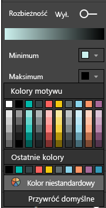
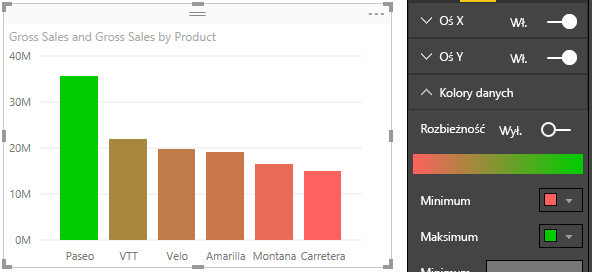
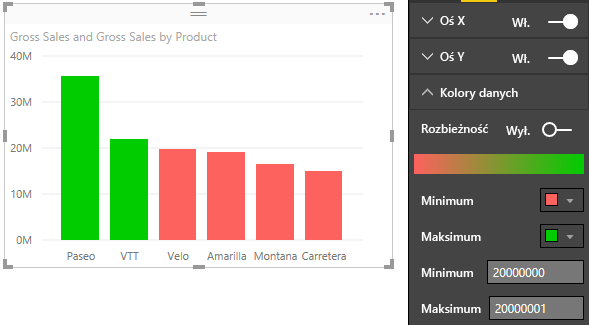
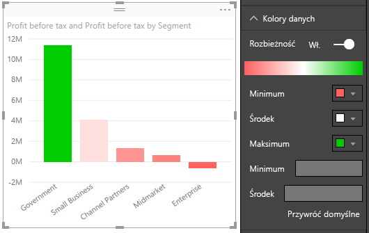

# Porady i wskazówki dotyczące formatowania kolorów w usłudze Power BI
Usługa Power BI udostępnia wiele różnych sposobów dostosowywania pulpitów nawigacyjnych i raportów. Ten artykuł zawiera zbiór porad i wskazówek, dzięki którym Twoje wizualizacje usługi Power BI będą bardziej atrakcyjne, interesujące i dostosowane do Twoich potrzeb.

Opisano tu następujące wskazówki. Masz inną ciekawą wskazówkę? Świetnie! Wyślij ją do nas, a być może dodamy ją do tej listy.

* Zmienianie koloru pojedynczego punktu danych
* Zastosowanie kolorów wykresu na podstawie wartości liczbowej
* Zastosowanie kolorów punktów danych na podstawie wartości pola
* Dostosowywanie kolorów używanych na skali kolorów
* Używanie rozbieżnej skali kolorów
* Cofanie poleceń w usłudze Power BI

Aby wprowadzić zmiany, musisz edytować raport. Otwórz raport i wybierz pozycję **Edytuj raport** w obszarze menu u góry, jak pokazano na poniższej ilustracji.

Gdy okienko **Wizualizacje** zostanie wyświetlone wzdłuż prawej krawędzi kanwy **Raport**, możesz zacząć dostosowywanie. Jeśli okienko nie zostanie wyświetlone, wybierz strzałkę w prawym górnym rogu, aby je otworzyć.

## Zmienianie koloru pojedynczego punktu danych
Czasami chcesz wyróżnić jeden konkretny punkt danych. Mogą to być dane sprzedażowe dotyczące wprowadzenia nowego produktu na rynek lub lepsze wyniki jakości po uruchomieniu nowego programu. W usłudze Power BI można wyróżnić konkretny punkt danych, zmieniając jego kolor.

Poniższa wizualizacja klasyfikuje jednostki sprzedane według segmentu produktu. 

Teraz wyobraź sobie, że chcesz wyróżnić segment **Wygoda**, aby przy użyciu koloru przedstawić wyniki tego całkiem nowego segmentu. Oto odpowiednie kroki:

Rozwiń sekcję **Kolory danych** i ustaw suwak **Pokaż wszystkie** w położeniu Włączone. Spowoduje to wyświetlenie kolorów dla każdego elementu danych w wizualizacji. Po ustawieniu kursora na punktach danych zostanie włączone przewijanie, co pozwala modyfikować dowolne punkty danych.

Ustaw pozycję **Wygoda** na kolor pomarańczowy. 

Po wybraniu koloru punkt danych **Wygoda** ma ładny odcień pomarańczowego i zdecydowanie się wyróżnia.

Nawet jeśli zmienisz typy wizualizacji, a następnie powrócisz, usługa Power BI zapamiętuje Twój wybór i zachowuje kolor pomarańczowy punktu danych **Wygoda**.

Możesz zmienić kolor punktu danych dla jednego, kilku lub wszystkich elementów danych w wizualizacji. Na przykład wizualizacja może naśladować kolory firmowe. 

Kolorów można używać w różnych sytuacjach. W następnej sekcji przyjrzymy się gradientom.

## Zastosowanie kolorów wykresu na podstawie wartości liczbowej
Wykresy często wyglądają lepiej po dynamicznym zastosowaniu kolorów na podstawie wartości liczbowej pola. Dzięki temu możesz pokazać inną wartość niż zazwyczaj dla rozmiaru kolumny i przedstawić dwie wartości na jednym wykresie. Możesz też wyróżnić punkty danych większe (lub mniejsze) niż określona wartość — na przykład w celu wyróżnienia obszarów o małej rentowności.

W poniższych sekcjach przedstawiono różne sposoby stosowania kolorów na podstawie wartości liczbowej.

## Zastosowanie kolorów punktów danych na podstawie wartości
Aby zmienić kolor na podstawie wartości, przeciągnij pole, które ma być podstawą koloru, do obszaru **Nasycenie koloru** w okienku **Pola**. Na poniższej ilustracji pole **%Market Share SPLY YTD** zostało przeciągnięte do obszaru **Nasycenie koloru**. 

W okienku formatowania w obszarze **Kolory danych** określ, jak wartość **%Market Share SPLY YTD** zmieni kolor i cieniowane na wykresie kolumnowym. W tym przykładzie niższy procentowy udział w rynku zostanie oznaczony jaśniejszym kolorem niebieskim, a większe wartości — ciemniejszym kolorem niebieskim.

Jak widać, mimo że sprzedaliśmy większą liczbę jednostek kategorii **Productivity** i **Extreme** (kolumny są wyższe), element **Moderation** ma większy procentowy udział w rynku **%Market Share SPLY YTD** (jego kolumna ma bardziej nasycony kolor).

## Dostosowywanie kolorów używanych na skali kolorów
Kolory używane na skali kolorów można dostosowywać. Domyślnie najniższa wartość danych jest zamapowana na najmniej nasycony kolor, a najwyższa wartość — na najbardziej nasycony kolor. Na powyższej ilustracji użyliśmy gradientu niebieskiego. 

Rozwiń sekcję **Kolory danych**, aby wyświetlić gradient kolorów używany do wizualizowania danych. Zakres kolorów jest pokazany na pasku gradientu, który przedstawia kolory między wartością **Minimum** i wartością **Maksimum**, gdzie kolor wartości **Minimum** znajduje się po lewej stronie, a kolor wartości **Maksimum** znajduje się po prawej stronie.

Aby zmienić skalę w celu używania innego zakresu kolorów, wybierz listę rozwijaną kolorów obok pozycji **Minimum** lub **Maksimum** i wybierz kolor. Na poniższej ilustracji przedstawiono zmianę koloru wartości **Maksimum** na czarny — pasek gradientu pokazuje nowy zakres kolorów między wartościami **Minimum** i **Maksimum**.

Możesz również zmienić sposób mapowania wartości na te kolory. Na poniższej ilustracji kolory dla wartości **Minimum** i **Maksimum** ustawiono odpowiednio na pomarańczowy i zielony.

Zwróć uwagę, jak na pierwszym obrazie kolumny na wykresie odzwierciedlają gradient pokazany na pasku — największa wartość jest zielona, najmniejsza jest pomarańczowa, a każda kolumna pomiędzy ma odcień z zakresu od koloru zielonego do pomarańczowego.

Teraz zobaczmy, co się stanie, gdy w polach wartości **Minimum** i **Maksimum** wstawimy wartości liczbowe. Te pola znajdują się poniżej selektorów koloru dla wartości **Minimum** i **Maksimum** (jak pokazano na poniższej ilustracji). W polu **Minimum** ustawmy wartość 20 000 000, a w polu **Maksimum** ustawmy wartość 20 000 001.

Po ustawieniu tych wartości gradient nie jest już stosowany do wartości na wykresie mniejszych niż wartość **Minimum** lub większych niż wartość **Maksimum**. Każda kolumna o wartości większej niż wartość **Maksimum** ma kolor zielony, z każda kolumna o wartości mniejszej niż wartość **Minimum** ma kolor czerwony.

## Używanie rozbieżnej skali kolorów
Czasami dane mogą mieć naturalnie rozbieżną skalę. Na przykład zakres temperatur ma naturalny środek w punkcie zamarzania, a wynik rentowności ma naturalny punkt środkowy (zero).

Aby użyć rozbieżnej skali kolorów, przesuń suwak **Rozbieżność** na pozycję **Włączone**. Po włączeniu opcji **Rozbieżność** jest wyświetlany dodatkowy selektor kolorów i dodatkowe pole wartości, obydwa o nazwie **Środek**, jak pokazano na poniższej ilustracji.

Gdy opcja **Rozbieżność** jest włączona, możesz ustawić różne kolory dla wartości **Minimum**, **Maksimum** i **Środek**. Na poniższej ilustracji w polu **Środek** ustawiono wartość jeden, więc kolumny z wartościami większymi niż jeden mają odcienie koloru zielonego, a kolumny z wartościami mniejszymi niż jeden mają odcienie koloru czerwonego.

## Cofanie poleceń w usłudze Power BI
Podobnie jak wiele innych usług i programów firmy Microsoft, usługa Power BI umożliwia łatwe cofanie ostatniego polecenia. Załóżmy na przykład, że zmieniasz kolor punktu danych lub serii punktów danych, ale po wyświetleniu tego koloru na wizualizacji stwierdzasz, że Ci się nie podoba. Nie pamiętasz dokładnie, jaki kolor był wcześniej, ale wiesz, że chcesz go mieć z powrotem.

Aby **cofnąć** swoją ostatnią akcję lub kilka ostatnich akcji, wystarczy zrobić tak:

- Naciśnij klawisze CTRL+Z

## Opinia
Masz poradę, którą chcesz się podzielić? Wyślij ją do nas, a my sprawdzimy, czy możemy ją dodać do tej listy.

>[!NOTE]
>Te kolory, osie i powiązane dostosowania dostępne po wybraniu ikony **Format**, są również dostępne w programie Power BI Desktop.

## Następne kroki
[Wprowadzenie do korzystania z właściwości osi i formatowania kolorów](service-getting-started-with-color-formatting-and-axis-properties.md)

